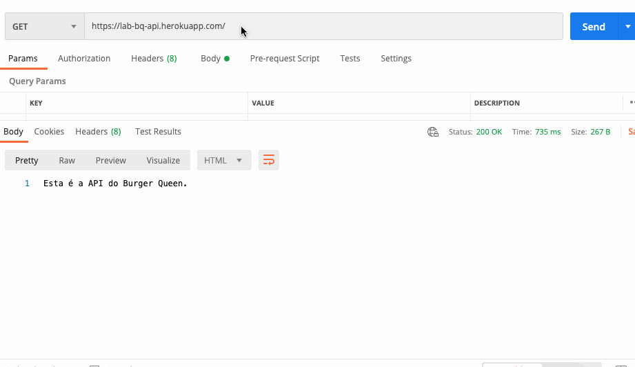

# Burger Queen API com Node - Back-end

## 1. Resumo do projeto

Neste projeto foi criado o back-end da aplicação [Burger Queen](https://burger-queen-lab-d4315.web.app/)

Como back-end, nesse caso, nos referimos a um _servidor web_, que basicamente é um programa que _ouve_ o que acontece na aplicação através de uma porta de rede, pela qual podemos enviar _requisições_ (_requests_) e obter _respostas_ (_responses_).

O servidor web deve _manejar_ as requisições que chegam e devolver respostas a elas, que serão enviadas de volta ao _cliente_. Quando falamos de _aplicações de servidor_, isso implica uma arquitetura de _cliente/servidor_, onde o cliente é um programa que faz requisições através de uma rede (por exemplo o navegador, o cURL, etc) e o servidor é o programa que recebe essas requisições e as responde.

## 2. Como utilizar?

Utilize o [link](https://lab-bq-api.herokuapp.com/) no [Postman](https://www.getpostman.com).

### Requisições

#### `Products`

* `GET /products`
* `GET /products/:id`
* `POST /products`
* `PUT /products/:id`
* `DELETE /products/:id`

#### `Orders`

* `GET /orders`
* `GET /orders/:id`
* `POST /orders`
* `PUT /orders/:id`
* `DELETE /orders/:id`

#### `Users`

* `GET /users`
* `GET /users/:id`
* `POST /users`
* `PUT /users/:id`
* `DELETE /users/:id`

## 3. Ferramentas utilizadas

1. [Docker](https://www.docker.com/) 
2. [PostgreSQL](https://www.postgresql.org/docs/)
3. [Sequelize](https://sequelize.org)
4. [Express](https://expressjs.com/pt-br/)
5. [Heroku](https://www.heroku.com/home)
6. [Node.js](https://nodejs.org/)
7. [Postman](https://www.getpostman.com)
8. Jest

## Desenvolvedora

* [Camila Roque](https://github.com/milaroque)
